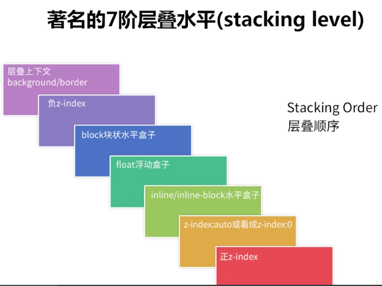

# css 面试题

## 盒模型

## flex

1. 容器

- flex-direction 属性决定主轴的方向（即项目的排列方向）。
- flex-wrap 默认情况下，项目都排在一条线（又称"轴线"）上。flex-wrap 属性定义，如果一条轴线排不下，如何换行。
- flex-flow flex-flow 属性是 flex-direction 属性和 flex-wrap 属性的简写形式，默认值为 row nowrap。
- justify-content justify-content 属性定义了项目在主轴上的对齐方式。
- align-items align-items 属性定义项目在交叉轴上如何对齐。
- align-content align-content 属性定义了多根轴线的对齐方式。如果项目只有一根轴线，该属性不起作用。

2. 项目

- order order 属性定义项目的排列顺序。数值越小，排列越靠前，默认为 0。
- flex-grow flex-grow 属性定义项目的放大比例，默认为 0，即如果存在剩余空间，也不放大。
- flex-shrink flex-shrink 属性定义了项目的缩小比例，默认为 1，即如果空间不足，该项目将缩小。
- flex-basis flex-basis 属性定义了在分配多余空间之前，项目占据的主轴空间（main size）。浏览器根据这个属性，计算主轴是否有多余空间。它的默认值为 auto，即项目的本来大小。
- flex flex 属性是 flex-grow, flex-shrink 和 flex-basis 的简写，默认值为 0 1 auto。后两个属性可选。
- align-self align-self 属性允许单个项目有与其他项目不一样的对齐方式，可覆盖 align-items 属性。默认值为 auto，表示继承父元素的 align-items 属性，如果没有父元素，则等同于 stretch。

## css 单位

https://zhuanlan.zhihu.com/p/122987171

```
% 百分比、cm 里面、mm 毫米、px 像素（计算机屏幕上的一个点）、in 英寸、pt 磅
rgb(x,x,x) rgb(x%,x%,x%) #rrggbb（十六进制）
em：1em 等于当前字体尺寸（继承父元素的字体尺寸）
rem：r 为 root，1rem 等于根元素字体尺寸（继承 html 的字体尺寸）
vh：1vh 等于可视窗口高度的 1/100
vw: 1vw 等于可视窗口宽度的 1/100
vmin：可视窗口宽高更小的值的 1/100
vmax：可视窗口宽高更大的值的 1/100
ex：当前字体的一个 x-height，一般为当前字体的一个 em 的一半，因为一个 'x' 字母一般为字体大小的一半
ch：设置 width:40ch 表示这个宽度可以容纳 40 个特定字体的字符
```

## css 选择器

```
1）标签选择器 p
2）ID 选择器 #id
3）类选择器 .class
4）通配符 *
5）派生选择器 以空格连接多个选择器，表示 ... 的后代，可以隔代
6）子元素选择器 以 > 连接多个选择器，表示 ... 的子元素，不能隔代
7）相邻选择器 以 + 连接多个选择器，表示紧跟在 ... 的兄弟元素
8）分组选择器 以逗号连接多个选择器，同时选中这些没有关联的选择器
9）属性选择器 以 [] 来根据元素的属性名和属性值来选中具有对应信息的元素，可以写多个 [] 来多属性匹配，也可以根据具体的属性值来匹配，还可以通过正则来进行更复杂的匹配
10）伪类 以单冒号开头，可以找到不能用常规选择器获取到不存在 DOM 树中的信息，可以同时使用多个伪类
11）伪元素 以双冒号开头，可以像真正的元素那样去展现行为，但并不是真正的元素，只能同时使用一个伪元素

权重优先级：
1）内联样式
2）ID 选择器
3）类选择器、伪类、属性选择器
4）标签选择器、伪元素选择器
5）通配符、子元素选择器、相邻选择器、派生选择器、分组选择器
```

## bfc 清除浮动

https://zhuanlan.zhihu.com/p/25321647

### 特性

具有 BFC 特性的元素可以看作是隔离了的独立容器，容器里面的元素不会在布局上影响到外面的元素，并且 BFC 具有普通容器所没有的一些特性。通俗一点来讲，可以把 BFC 理解为一个封闭的大箱子，箱子内部的元素无论如何翻江倒海，都不会影响到外部。

### 触发，创建 bfc

只要元素满足下面任一条件即可触发 BFC 特性：

1. body 根元素
2. 浮动元素：float 除 none 以外的值
3. 绝对定位元素：position (absolute、fixed)
4. display 为 inline-block、table-cells、flex
5. overflow 除了 visible 以外的值 (hidden、auto、scroll)

### BFC 特性及应用

1. 同一个 BFC 下外边距会发生折叠
2. BFC 可以包含浮动的元素（清除浮动）

```
中文叫块级格式上下文，BFC 原理（BFC 的渲染规则）如下：中文叫块级格式上下文，BFC 原理（BFC 的渲染规则）如下：
1）在 BFC 这个元素的垂直方向的边距会发生重叠，即 BFC 内部的兄弟元素中间会发生边距重叠。解决方法，给某个兄弟元素增加一个父元素，给父元素创建一个 BFC，其他兄弟元素不会和这个新增的父元素发生边距重叠；
2）BFC 区域不会与浮动元素 box 重叠，这就是用来清除浮动的原理。比如左边是浮动元素，右边是一个 div，如果两者高度不相等，整个布局就会坍塌，所以为这个 div 创建一个 BFC，就能得到我们想要的布局；
3）BFC 在页面是一个独立的容器，外面的元素不会影响里面的元素，反之亦然；
4）计算 BFC 高度时，浮动元素也会参与计算。这就是在浮动元素父元素上增加 overflow:hidden 会将浮动元素计算入内，而不会使父元素高度坍塌或者背景颜色显示不出来的原因。
1）在 BFC 这个元素的垂直方向的边距会发生重叠，即 BFC 内部的兄弟元素中间会发生边距重叠。解决方法，给某个兄弟元素增加一个父元素，给父元素创建一个 BFC，其他兄弟元素不会和这个新增的父元素发生边距重叠；
2）BFC 区域不会与浮动元素 box 重叠，这就是用来清除浮动的原理。比如左边是浮动元素，右边是一个 div，如果两者高度不相等，整个布局就会坍塌，所以为这个 div 创建一个 BFC，就能得到我们想要的布局；
3）BFC 在页面是一个独立的容器，外面的元素不会影响里面的元素，反之亦然；
4）计算 BFC 高度时，浮动元素也会参与计算。这就是在浮动元素父元素上增加 overflow:hidden 会将浮动元素计算入内，而不会使父元素高度坍塌或者背景颜色显示不出来的原因。

创建 BFC 的方式：
1）只要 overflow 值不为 visible（默认值），就创建了 BFC；
2）float 值不为 noun（默认值），只要设置了浮动，就创建了 BFC；
3）position 值不为 static（默认值）或者是 relative，就创建了 BFC；
4）将 display 值设置为 inline-box 或者是 table-cell（只要跟 table 相关的那几个），就创建了 BFC。

对应的内联元素的格式化上下文叫 IFC。

通过 BFC/IFC 解决边距重叠问题，三种边距重叠的情况：

1）父子元素，父元素的高度跟子元素重叠，解决方法是为父元素创建一个 BFC；
2）兄弟元素，比如一个有上边距，一个有下边距，这个时候会发生重叠，重叠的原则是取最大值，解决方法是给其中一个元素增加一个父元素，为这个父元素创建一个 BFC；
3）空元素同时有 marging-top 和 marging-bottom 时，会取一个最大值作为边距，解决方法是为空元素创建一个 BFC。
```

## 层叠上下文

https://www.cnblogs.com/leftJS/p/11063683.html


## 常见页面布局

https://www.cnblogs.com/soyxiaobi/p/9594557.html

### 静态布局(Static Layout)

1. 布局概念
   最传统、原始的 Web 布局设计。网页最外层容器(outer)有固定的大小,所有的内容以该容器为标准,超出宽高的部分用滚动条(overflow:scroll)来实现滚动查阅。

2. 优点
   采用的是 css2 之前的写法,不存在浏览器兼容性。布局简单。

3. 缺点
   但是移动端不可以使用 pc 端的页面,两个页面的布局不一致,移动端需要自己另外设计一个布局并使用不同域名呈现。

4. 注意
   PC 端限制了最小的宽度, 低于了则以最小宽度出现滚动条
   移动端限制了最大的宽度, 超过了则以最大宽度居中显示

### 流式布局(Liquid Layout)

1. 布局概念
   流式布局也叫百分比布局

这边引入一下自适应布局:
分别为不同的屏幕设置布局格式，当屏幕大小改变时，会出现不同的布局，意思就是在这个屏幕下这个元素块在这个地方，但是在那个屏幕下，这个元素块又会出现在那个地方。只是布局改变，元素不变。可以看成是不同屏幕下由多个静态布局组成的。

而流式布局的特点是随着屏幕的改变，页面的布局没有发生大的变化，可以进行适配调整，这个正好与自适应布局相补。

流式布局常用的设计模板:
左侧固定+右侧自适应
左右固定宽度+中间自适应(参考京东手机版)

页面元素的宽度按照屏幕进行适配调整，主要的问题是如果屏幕尺度跨度太大，那么在相对其原始设计而言过小或过大的屏幕上不能正常显示 。 你看到的页面，元素的大小会变化而位置不会变化——这就导致如果屏幕太大或者太小都会导致元素无法正常显示。

2. 优点
   元素的宽高用百分比做单位，元素宽高按屏幕分辨率调整，布局不发生变化

3. 缺点
   屏幕尺度跨度过大的情况下，页面不能正常显示。

### 弹性布局(Flex Layout)

1. 布局概念
   弹性布局是 CSS3 引入的强大的布局方式，用来替代以前 Web 开发人员使 的一些复杂易错的 hacks 方法(如 float 实现流式布局)。

2. 优点
   简单、方便、快速

3. 缺点
   CSS3 新特性,浏览器兼容性非常头疼。而且手机浏览器对 flex 的支持也不是很理想。

### 响应式布局(Responsive layout)

采用自适应布局和流式布局的综合方式，为不同屏幕分辨率范围创建流式布局

现在优秀的页面都追求一套代码可以实现三端的浏览;
从概念可以看出来,自适应布局的诞生是为了实现不同屏幕分辨率的终端上浏览网页的不同展示方式。

通过响应式设计能使网站在手机和平板电脑上有更好的浏览阅读体验。屏幕尺寸不一样展示给用户的网页内容也不一样.

利用媒体查询可以检测到屏幕的尺寸(主要检测宽度)，并设置不同的 CSS 样式，就可以实现响应式的布局。

大名鼎鼎的 bootstrap 就是响应式布局的专家。

官方放出狠话:
Bootstrap 提供了一套响应式、移动设备优先的流式栅格系统，随着屏幕或视口（viewport）尺寸的增加，系统会自动分为最多 12 列。它包含了易于使用的预定义类，还有强大的 mixin 用于生成更具语义的布局。

## css 预处理，后处理

```
CSS 预处理器是用一种专门定义的编程语言，为 CSS 增加编程特性，可以在 CSS 中使用变量、循环、嵌套等功能，将 CSS 作为目标生成文件，让 CSS 更加简洁、可读性强、可维护性强等好处，主要有三种 CSS 预处理器：Sass、LESS 和 Stylus，通常使用 webpack 构建工具将它们生成的文件转换成 CSS。

CSS 后处理器是对 CSS 进行处理，并最终生成 CSS 预处理器，属于广义上的预处理器。后处理器通常采用 autoprefixer 的方案，根据定义的 browser list 自动添加前缀。
```

## css3 新特性

animation 和 transiton 的相关属性
animate 和 translate

1. 先从 css3 的新选择器开始作答：

E:nth-child(n) 选择器匹配其父元素的第 n 个子元素，不论元素类型，n 可以使数字，关键字，或公式

E:nth-of-type(n) 选择与之其匹配的父元素的第 N 个子元素

E:frist-child 相对于父级做参考，“所有”子元素的第一个子元素，并且“位置”要对应

E：frist-of-type 相对于父级做参考，“特定类型”（E）的第一个子元素

E：empty 选择没有子元素的每个 E 元素

E:target 选择当前活动的 E 元素

::selection 选择被用户选取的元素部分

属性选择器

E[abc*="def"] 选择 adc 属性值中包含子串"def"的所有元素

2. 文本

text-shadow:2px 2px 8px #000;参数 1 为向右的偏移量，参数 2 为向左的偏移量，参数 3 为渐变的像素，参数 4 为渐变的颜色

text-overflow:规定当文本溢出包含元素时发生的事情 text-overflow:ellipsis(省略)

text-wrap:规定文本换行的规则

word-break 规定非中日韩文本的换行规则

word-wrap 对长的不可分割的单词进行分割并换行到下一行

white-space: 规定如何处理元素中的空白 white-space:nowrap 规定段落中的文本不进行换行

3. 边框

border-raduis:50%边框的圆角

border-image 边框图片

.border-image {
border-image-source:url(images/border.png);

    boder-image-slice:27;

    border-image-width:10px;

    border-iamge-repeat:round; (round平铺) 平铺效果不作用于四角，只适应与四边

}

4. 背景

rgba

backgrounnd-size:cover/contain，其中 background-size：cover，会使“最大”边进行缩放，另一边同比缩放，铺满容器，超出部分会溢出。background-size:contain，会使“最小”边进行缩放，另一边同比缩放，不一定铺满容器，会完整显示图片

5. 渐变

linear-gradient

background-image:linear-gradient(90deg,yellow 20%,green 80%)

radial-gradient

background-iamge:radial-gradient(120px at center center,yellow,green)

6. 多列布局

column-count

column-width

column-gap

column-rule

7. 过渡

transition

transition-property:width //property 为定义过渡的 css 属性列表，列表以逗号分隔

transition-duration:2s; //过渡持续的时间

transition-timing-function:ease;

transition-delay:5s //过渡延迟 5s 进行

8. 动画、旋转

animation

transform ：translate（x,y) rotate(deg) scale(x,y)

translate

scale

rotate

skew（倾斜）

9. flex 布局

10. @media 媒体查询

## display 哪些取值

### inline inline-block block

常见的 inline 内联元素：
span、img、a、lable、input、abbr（缩写）、em（强调）、big、cite（引用）、i（斜体）、q（短引用）、textarea、select、small、sub、sup，strong、u（下划线）、button（默认 display：inline-block））

常见的 block 块级元素：
div、p、h1…h6、ol、ul、dl、table、address、blockquote、form

常见的 inline-block 内联块元素：
img、input

### inline 元素

inline 元素全称 Inline Elements，英文原意:An inline element does not start on a new line and only takes up as much width as necessary.一个内联元素不会开始新的一行，并且只占有必要的宽度。

- 特点:
  - 和其他元素都在一行上；
  - 元素的高度、宽度、**行高及顶部和底部边距不可设置**；
  - 元素的宽度就是它包含的文字或图片的宽度，不可改变。

### block 元素

block 元素全称 Block-level Elements，英文原意:A block-level element always starts on a new line and takes up the full width available (stretches out to the left and right as far as it can).一个块级元素总是开始新的一行，并且占据可获得的全部宽度(左右都会尽可能的延伸到它能延伸的最远)

- 特点:
  - 每个块级元素都从新的一行开始，并且其后的元素也另起一行。（一个块级元素独占一行）;
  - 元素的高度、宽度、行高以及顶和底边距都可设置;
  - 元素宽度在不设置的情况下，是它本身父容器的 100%（和父元素的宽度一致），除非设定一个宽度。

### inline-block 元素

inline-block 元素，英文释义:inline-block elements are like inline elements but they can have a width and a height.它像内联元素，但具有宽度和高度。

- 特点:

  - 和其他元素都在一行上；
  - 元素的高度、宽度、行高以及顶和底边距都可设置

### img、input 到底是行内还是块级元素？

```
一、img、input属于行内替换元素。height/width/padding/margin均可用。效果等于块元素。
      行内非替换元素，例如, height/width/padding top、bottom/margin top、bottom均无效果。只能用padding left、right和margin left、right改变宽度。
二、在文档类型定义（DTD）中对不同的元素规定了不同的类型，这也是DTD对文档之所以重要的原因之一。
从元素本身的特点来讲，可以分为不可替换元素和替换元素。

不可替换元素
(X)HTML 的大多数元素是不可替换元素，即其内容直接表现给用户端（例如浏览器）。
如：<h1>我是标题</h1>

替换元素
替换元素就是浏览器根据元素的标签和属性，来决定元素的具体显示内容。

例如浏览器会根据标签的src属性的值来读取图片信息并显示出来，而如果查看(X)HTML代码，则看不到图片的实际内容；又例如根据<input>标签的type属性来决定是显示输入框，还是单选按钮等。

(X)HTML中的、<input>、<textarea>、<select>、<object>都是替换元素。这些元素往往没有实际的内容，即是一个空元素。

如：

<input type="submit" name="Submit" value="提交"/>

替换元素一般有内在尺寸，所以具有width和height，可以设定。例如你不指定img的width和height时，就按其内在尺寸显示，也就是图片被保存的时候的宽度和高度。

对于表单元素，浏览器也有默认的样式，包括宽度和高度。
```

## 相邻的两个 inline-block 节点为什么会出现间隔，该如何解决

```
是换行符引起的间隔问题，间隙为 4px。
消除间隙的方法：
1）去掉换行符；
2）对父元素添加 font-size:0，将字体大小设置为 0，换行符也会为 0px，从而消除间隙，再为 inline-block 元素设置我们需要的字体大小；
3）将 inline-block 的 margin-right/left 设置为 -4px；
4）将父元素的 letter-spacing 和 word-spacing 设置为 -4px，这两个属性会增加或减少字符间隔。
inline-block 还有两个问题：即不同高度的两个 inline-block 顶部不对齐，以及 inline-block 底部多出几像素（多出空白）。解决方法是为 inline-block 元素设置 vertical-align:top。是换行符引起的间隔问题，间隙为 4px。
```

## meta viewport 移动端适配

## CSS 实现宽度自适应 100%，宽高 16:9 的比例的矩形

看 html

## rem 布局的优缺点

```
相对于 em 的好处是：
  不会发生逐渐增大或者减小字体尺寸的情况，因为始终继承根元素的字体尺寸；
  rem 单位不仅可应用于字体大小，还可以用于设定宽高等其他大小，使页面可以适配不同屏幕尺寸。
缺点：
rem 一般只用于移动端。
```

## 画三角形

## 1 像素边框问题 dpr

原因：有些手机分辨率比较高，是二倍屏或者三倍屏，在 CSS 中定义 border 为 1px，这些手机可能是两个物理像素或者是三个物理像素的高度（即看起来比 1px 粗）。
解决方法：通过背景图片实现、通过 transform:scale(0.5) 实现、通过 viewport + rem 实现
还可以引入 border.css 来实现

1. 使用 border-image 实现根据需求选择图片，然后根据 css 的 border-image 属性设置
   优点：可以设置单条、多条表框。缺点：更换颜色和样式麻烦，某些设备上会模糊。
2. 使用 background-image 实现
3. 使用 box-shadow 模拟边框
   优点：代码少，兼容性好。缺点：边框有阴影，颜色变浅。
4. 伪元素+transform 媒体查询
   构建 1 个伪元素, border 为 1px, 再以 transform 缩放到 50%。
